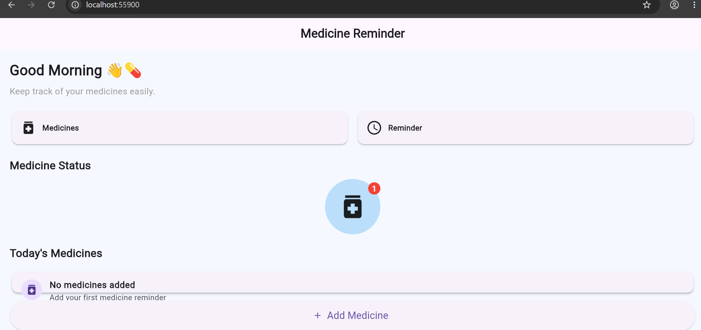

# 💊 Medicine Reminder App

A simple Flutter-based Medicine Reminder App developed as a college project.

The application helps users keep track of their medicines by adding medicine details, dosage, and reminder time.

## 📱 Features

- Add medicine
- Enter medicine name
- Enter dosage
- Select reminder time
- View added medicines
- Delete medicines
- Simple and user-friendly interface

## 🛠️ Technologies Used

- Flutter
- Dart
- Android Studio
- Visual Studio Code
- Git
- GitHub

## 🎯 Objective

The main objective of this project is to develop a simple application that helps users organize their medicine schedules and remember their medicines on time.

## 🚀 How to Run

1. Clone the repository:

```bash
git clone https://github.com/Jyothi269/medicine_reminder_app.git

## Experiment 2: Exploring Flutter Widgets and Layouts using Row, Column and Stack

This experiment demonstrates the use of Flutter layout widgets such as Row, Column and Stack. In the Medicine Reminder App, Column is used to arrange the main content vertically, Row is used to arrange medicine information horizontally, and Stack is used to display a medicine icon with a notification badge.

### Output

